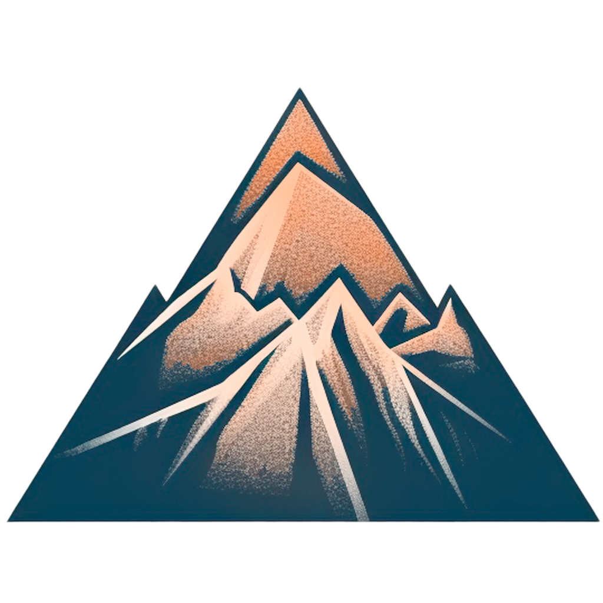

<a name="readme-top"></a>

[![LinkedIn][linkedin-shield]][linkedin-url]

<!-- PROJECT LOGO -->
<br />
<div align="center">
  <a href="https://github.com/ClementRosa/3d_island">
    
  </a>

  <h3 align="center">A project with react three fiber</h3>

  <p align="center">
  An innovative project integrating innovative technologies!
    <br />
    <a href="https://github.com/ClementRosa/3d_island"><strong>Explore the repo »</strong></a>
  </p>
</div>


<!-- TABLE OF CONTENTS -->
<details>
  <summary>Table of Contents</summary>
  <ol>
    <li>
      <a href="#about-the-project">About The Project</a>
      <ul>
        <li><a href="#built-with">Built With</a></li>
      </ul>
    </li>
    <li>
      <a href="#getting-started">Getting Started</a>
      <ul>
        <li><a href="#prerequisites">Prerequisites</a></li>
        <li><a href="#installation">Installation</a></li>
      </ul>
    </li>
    <li><a href="#license">License</a></li>
    <li><a href="#contact">Contact</a></li>
    <li><a href="#acknowledgments">Acknowledgments</a></li>
  </ol>
</details>


<!-- ABOUT THE PROJECT -->
## About The Project

[![Product Name Screen Shot][product-screenshot]](https://example.com)

In today's dynamic world, the key to project success lies in the ability to embrace innovation and creativity. These two inherently linked elements are the engines that propel ideas beyond conventional boundaries, giving rise to unprecedented solutions and outstanding results.

Innovation is the art of pushing the limits of conventional thinking. It is a mindset that encourages challenging the status quo and exploring new paths. In our project, innovation becomes the catalyst that transforms challenges into opportunities and obstacles into advantages. Each step is an invitation to rethink, reinvent, and explore uncharted territories.

Creativity, on the other hand, is the personal expression of innovation. It is the means by which we inject our identity and unique flair into the process. In our project, creativity flourishes through the diversity of ideas, perspectives, and approaches. It transcends conventions, adding a touch of originality to every aspect, from initial concepts to concrete realization.

By merging innovation and creativity, our project becomes a playground where ideas come to life. Each team member is a crucial link in the chain of innovation, contributing uniquely to the construction of a strong and innovative structure. Innovation stimulates creativity, which in turn nourishes innovation, creating a virtuous circle of bold ideas and outstanding achievements.

To succeed, we must cultivate an environment conducive to the blossoming of innovation and creativity. Encouraging the free expression of ideas, fostering collaboration, and embracing diverse opinions are ways to stimulate innovative thinking. The willingness to experiment, learn from failure, and constantly iterate is essential to maintain a continuous flow of innovative ideas.

In conclusion, in our project, innovation and creativity are not merely concepts but essential pillars of our approach. They are the driving force that propels our team toward excellence. By cultivating these values, we shape a future where every challenge is an opportunity, every idea finds its place, and originality is celebrated. Together, we are the architects of a new and promising reality, guided by innovation and inspired by creativity.

<p align="right">(<a href="#readme-top">back to top</a>)</p>


### Built With


* [![React][React.js]][React-url]
* [![Three js][Threejs]][Threejs-url]
* [![Tailwind CSS][TailwindCSS]][TailwindCSS-url]


<p align="right">(<a href="#readme-top">back to top</a>)</p>


<!-- GETTING STARTED -->
## Getting Started


### Prerequisites

* npm
  ```sh
  npm install npm@latest -g
  ```

### Installation

1. Get a free API Key and create a service and template at [EmailJS](https://www.emailjs.com/)
2. Enter your API in `.env`
    ```sh
    VITE_APP_EMAILJS_SERVICE_ID='service_'
    VITE_APP_EMAILJS_TEMPLATE_ID='template_'
    VITE_APP_EMAILJS_PUBLIC_KEY='my_key'
     ```
3. Clone the repo
   ```sh
   git clone https://github.com/ClementRosa/3d_island
   ```
4. Install NPM packages
   ```sh
   npm install
   ```
5. Run dev
   ```sh
   npm run dev
   ```

<p align="right">(<a href="#readme-top">back to top</a>)</p>


<!-- LICENSE -->
## License

Distributed under the MIT License.

<p align="right">(<a href="#readme-top">back to top</a>)</p>

<!-- CONTACT -->
## Contact

Rosa Clément - [@linkedin](https://www.linkedin.com/in/clementrosa/)

<p align="right">(<a href="#readme-top">back to top</a>)</p>


<!-- ACKNOWLEDGMENTS -->
## Acknowledgments

* [Bruno Simon](https://threejs-journey.com/#)
* [JS Mastery](https://www.jsmastery.pro/)

<p align="right">(<a href="#readme-top">back to top</a>)</p>


<!-- MARKDOWN LINKS & IMAGES -->
<!-- https://www.markdownguide.org/basic-syntax/#reference-style-links -->
[linkedin-shield]: https://img.shields.io/badge/-LinkedIn-black.svg?style=for-the-badge&logo=linkedin&colorB=555
[linkedin-url]: https://www.linkedin.com/in/clementrosa/
[product-screenshot]: images/screenshot.png

[TailwindCSS]:https://img.shields.io/badge/tailwindcss-%2338B2AC.svg?style=for-the-badge&logo=tailwind-css&logoColor=white
[Tailwindcss-url]: https://tailwindcss.com/

[React.js]: https://img.shields.io/badge/React-20232A?style=for-the-badge&logo=react&logoColor=61DAFB
[React-url]: https://reactjs.org/

[Threejs]: https://img.shields.io/badge/threejs-black?style=for-the-badge&logo=three.js&logoColor=white
[Threejs-url]: https://docs.pmnd.rs/react-three-fiber/getting-started/introduction

